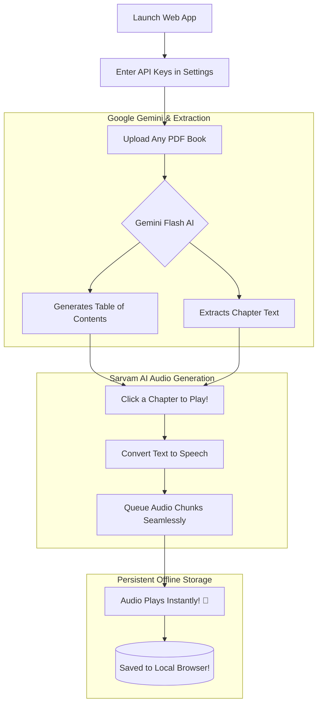

<div align="center">
  
# 🎧 AI Book Narrator

An incredibly smart, lightning-fast, and completely private **offline-first** web application that reads your PDF books to you dynamically using state-of-the-art Generative AI and advanced Text-to-Speech engines.
  
</div>

---

## 📖 How Does It Work?

Instead of relying on clunky, slow cloud servers to store your private documents, **AI Book Narrator** runs directly in your browser! It uses the power of your own local computer (via IndexedDB) combined with Google Gemini and Sarvam AI to create a completely private listening experience.



---

## 🛠️ Step-by-Step Usage Guide

We designed this app to be incredibly easy to use. Follow these simple steps:

### 1. Configure the AI Brain (One-Time Setup)
Since this app is totally free and open-source, you just need to plug in your own free AI keys!
1. Click the **Gear Icon (Settings)** in the top right corner of the app.
2. Get your free **Google Gemini Key** from [Google AI Studio](https://aistudio.google.com/). Paste it in.
3. Get your free **Sarvam AI Key** from [Sarvam Platform](https://www.sarvam.ai/). Paste it in.
4. Click **Connect Engine**. 
*(Don't worry, your keys are NEVER sent to us. They are saved entirely locally on your computer's browser).*

### 2. Upload Your First Book
1. Click the massive **Choose PDF** button in the middle of the screen.
2. Select any local PDF file (like a textbook, novel, or research paper).
3. Wait 5 to 60 seconds (depending on book length) while Gemini violently rips through the pages to meticulously build you a beautiful, clickable Table of Contents.

### 3. Sit Back and Listen
1. You will see a list of individual Chapters appear in the navigation menu.
2. **Click on any Chapter.**
3. The app will instantaneously start speaking to you! 
4. **Behind the scenes:** While you listen to the first 10 seconds of speech, our robust Async Queue system works silently in the background fetching the next 50 seconds to ensure you *never* hit a loading screen or a Rate Limit.

### 4. Close Your Browser (It's Offline!)
Next time you open the website, you don't need to re-upload the same book! The massive PDF document, the extracted text, and the generated audio chunks have been cryptographically cached into your browser's local hard drive via `IndexedDB`. 

---

## 💻 Tech Stack & Developer Setup

If you want to run this application locally on your own computer instead of using the live link:

1. Copy the codebase:
```bash
git clone https://github.com/chetangoswami/Ai-Book-Narrator.git
cd Ai-Book-Narrator
```

2. Install modules:
```bash
npm install
```

3. Spin up the Vite Dev Server:
```bash
npm run dev
```

Built entirely with React, TypeScript, TailwindCSS, Native Web Audio APIs, and Firebase Hosting.